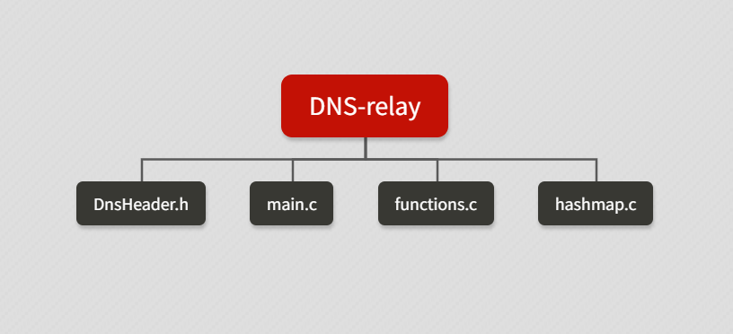
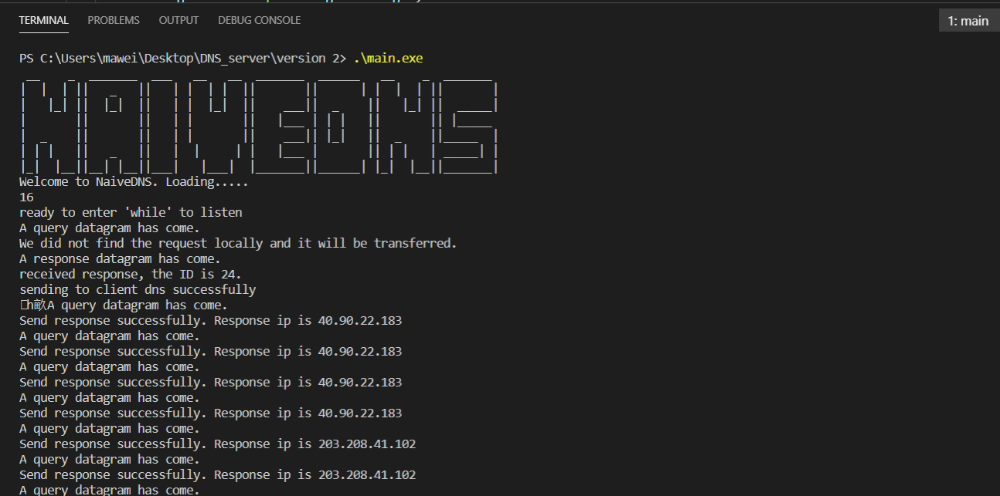

Note: if any student find this repository for his/her college course, DO NOT copy and submit it directly.   
注意： 如果有哪位学弟学妹发现了这个仓库，千万不要直接抄下来，可能会有你意想不到的情况发生。
# DNS relay - NAIVE DNS

Author: Meng Chen, Weijian Ma
Date: 2020-08

This project implement a DNS relay working on Windows platform, which supports users to ban or route specific IP address and could be used in IPV4/6 network.

Fully compliant with RFC1034-1035. 
```
 __    _  _______  ___   __   __  _______  ______   __    _  _______
|  |  | ||   _   ||   | |  | |  ||       ||      | |  |  | ||       |
|   |_| ||  |_|  ||   | |  |_|  ||    ___||  _    ||   |_| ||  _____|
|       ||       ||   | |       ||   |___ | | |   ||       || |_____
|  _    ||       ||   | |       ||    ___|| |_|   ||  _    ||_____  |
| | |   ||   _   ||   |  |     | |   |___ |       || | |   | _____| |
|_|  |__||__| |__||___|   |___|  |_______||______| |_|  |__||_______|
Welcome to NaiveDNS. Loading.....
```

## Outline



## Example

